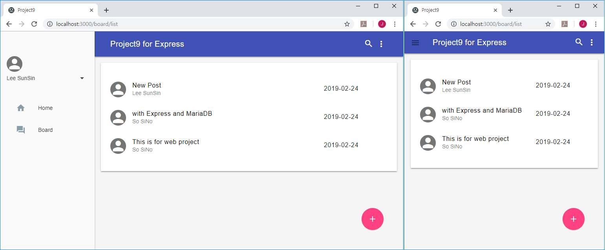

## project templete based on Node.js Express + MariaDB ##

This is a web project template based on Express and MariaDB.

To make web development easier and faster, a variety of frequently used functions have been implemented in advance.

### FEATURES ###

- Design templete (Material Design Lite) : Drawer, Dialog, Snackbar ...
- Simple Board, User Profile, Login
- Express Security settings (helmet)

### Install & Run ###

- git clone https://github.com/gujc71/project9_exp.git
- npm install
- create tables by running tables.sql from MariaDB
- npm start

### License ###
MIT